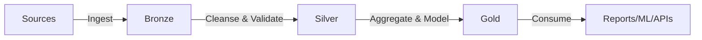

# Lakehouse Zones - Medallion Architecture

## Overview

The medallion architecture (Bronze-Silver-Gold) is a data design pattern used to logically organize data in a lakehouse. Each layer has a specific purpose and quality level.

## Bronze Layer (Raw Data)

### Purpose
The Bronze layer is the landing zone for raw data, preserving the source data in its original form.

### Characteristics
- **Data Quality**: As-is from source
- **Schema**: Flexible, schema-on-read
- **Format**: Original or Delta/Parquet
- **Transformations**: Minimal (type casting, metadata addition)
- **Updates**: Append-only or full replace
- **Retention**: Long-term (years)

### Naming Convention
```
bronze/<source_system>/<domain>/<entity>/
```

### Example Structure
```
/lakehouse/bronze/
├── erp/
│   ├── sales/
│   │   └── orders/
│   └── inventory/
│       └── products/
├── crm/
│   └── customers/
│       └── accounts/
└── external/
    └── weather/
        └── forecasts/
```

### Best Practices
1. Add ingestion timestamp for tracking
2. Preserve all source columns
3. Store raw files for audit/replay
4. Use Delta format for efficient updates
5. Implement partition strategy early

### Sample Bronze Table Schema
```python
# Bronze table with metadata
{
    "source_system": "ERP",
    "ingestion_timestamp": "2024-01-01T00:00:00Z",
    "source_file": "orders_20240101.csv",
    "raw_data": {
        # Original data structure preserved
    }
}
```

## Silver Layer (Cleansed Data)

### Purpose
The Silver layer contains validated, cleaned, and enriched data ready for analytics.

### Characteristics
- **Data Quality**: Validated and cleaned
- **Schema**: Enforced and standardized
- **Format**: Delta tables with schema enforcement
- **Transformations**: Deduplication, validation, enrichment
- **Updates**: Merge (upsert) operations
- **Retention**: Medium to long-term

### Naming Convention
```
silver/<domain>/<entity>/
```

### Example Structure
```
/lakehouse/silver/
├── sales/
│   ├── orders/
│   ├── order_items/
│   └── customers/
├── inventory/
│   ├── products/
│   └── warehouses/
└── finance/
    ├── transactions/
    └── accounts/
```

### Transformations Applied
1. **Data Cleansing**
   - Remove duplicates
   - Handle null values
   - Standardize formats (dates, phone numbers)
   - Fix data type issues

2. **Data Validation**
   - Business rule validation
   - Referential integrity checks
   - Range and constraint validation
   - Quality metrics tracking

3. **Data Enrichment**
   - Add derived columns
   - Lookup enrichment
   - Add surrogate keys
   - Calculate business metrics

### Best Practices
1. Implement SCD Type 2 for slowly changing dimensions
2. Add audit columns (created_at, updated_at, updated_by)
3. Use constraints and expectations
4. Document data quality rules
5. Implement data quality monitoring

### Sample Silver Table Schema
```python
# Silver table with quality and audit fields
{
    "order_id": "ORD-12345",
    "customer_id": "CUST-67890",
    "order_date": "2024-01-01",
    "order_amount": 150.00,
    "order_status": "COMPLETED",
    # Audit fields
    "created_at": "2024-01-01T10:00:00Z",
    "updated_at": "2024-01-01T12:00:00Z",
    "is_active": true,
    # Quality fields
    "data_quality_score": 95,
    "validation_passed": true
}
```

## Gold Layer (Curated Data)

### Purpose
The Gold layer contains business-level aggregations, dimensional models, and feature sets optimized for consumption.

### Characteristics
- **Data Quality**: Production-grade, highly trusted
- **Schema**: Optimized for consumption patterns
- **Format**: Highly optimized Delta tables
- **Transformations**: Aggregations, denormalization, modeling
- **Updates**: Based on business logic
- **Retention**: Based on regulatory/business requirements

### Naming Convention
```
gold/<business_domain>/<purpose>/
```

### Example Structure
```
/lakehouse/gold/
├── analytics/
│   ├── sales_summary/
│   ├── customer_360/
│   └── product_performance/
├── ml_features/
│   ├── customer_features/
│   └── product_features/
└── reporting/
    ├── daily_metrics/
    ├── monthly_summary/
    └── executive_dashboard/
```

### Common Patterns

#### 1. Dimensional Model (Star Schema)
```
fact_sales/
├── sales_key
├── date_key
├── customer_key
├── product_key
└── measures (amount, quantity, etc.)

dim_customer/
├── customer_key
├── customer_id
├── customer_name
└── attributes...
```

#### 2. Denormalized Tables
Wide tables optimized for specific use cases
- Pre-joined dimensions
- Pre-calculated metrics
- Optimized for query patterns

#### 3. Aggregated Views
```
daily_sales_summary/
├── date
├── region
├── total_sales
├── total_orders
└── average_order_value
```

### Best Practices
1. Optimize for read performance
2. Pre-calculate common aggregations
3. Denormalize for performance where appropriate
4. Use partitioning and Z-ordering
5. Implement data quality SLAs
6. Version models for reproducibility

### Sample Gold Table Schema
```python
# Gold table - Sales Summary
{
    "date": "2024-01-01",
    "region": "North America",
    "product_category": "Electronics",
    "total_sales": 50000.00,
    "total_orders": 150,
    "unique_customers": 120,
    "average_order_value": 333.33,
    "sales_vs_target": 105.5,  # %
    # Metadata
    "last_updated": "2024-01-02T00:00:00Z",
    "data_freshness_sla": "daily"
}
```

## Data Flow Between Layers



### Bronze to Silver
- Data quality checks
- Schema standardization
- Deduplication
- Business rule application

### Silver to Gold
- Dimensional modeling
- Aggregations
- Denormalization
- Feature engineering

## Zone Selection Guidelines

| Requirement | Bronze | Silver | Gold |
|------------|--------|--------|------|
| Raw data archive | ✅ | ❌ | ❌ |
| Data exploration | ⚠️ | ✅ | ✅ |
| Analytics | ❌ | ⚠️ | ✅ |
| ML features | ❌ | ⚠️ | ✅ |
| Reporting | ❌ | ❌ | ✅ |
| Real-time queries | ❌ | ⚠️ | ✅ |

## Implementation Checklist

- [ ] Define source systems and ingestion patterns
- [ ] Establish naming conventions per layer
- [ ] Design partition strategy for each layer
- [ ] Implement data quality framework
- [ ] Set up monitoring and alerting
- [ ] Document data lineage
- [ ] Define retention policies
- [ ] Create example pipelines
- [ ] Test data recovery procedures

## Next Steps

1. Review [Naming Conventions](naming-conventions.md)
2. Implement [Governance & Security](governance-security.md)
3. Follow [Deployment Guide](deployment.md)
4. Explore [Pipeline Examples](/examples/pipelines)
